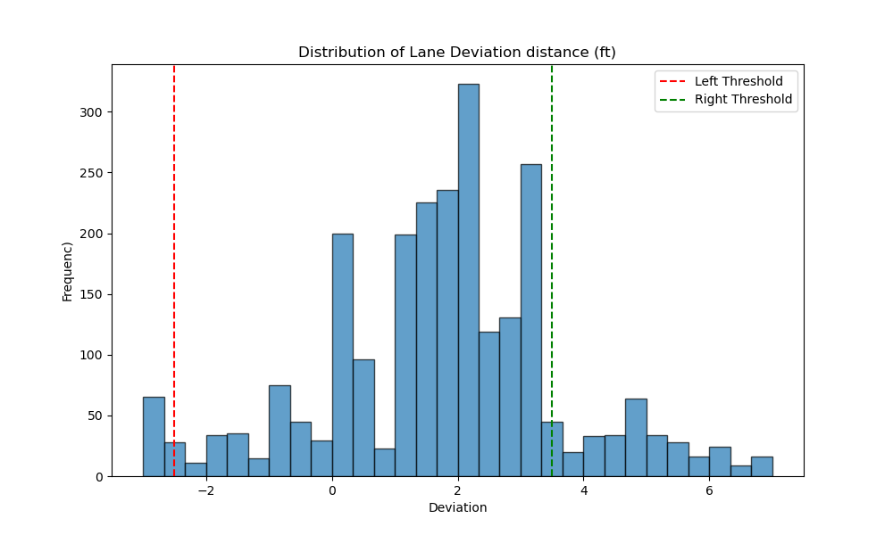
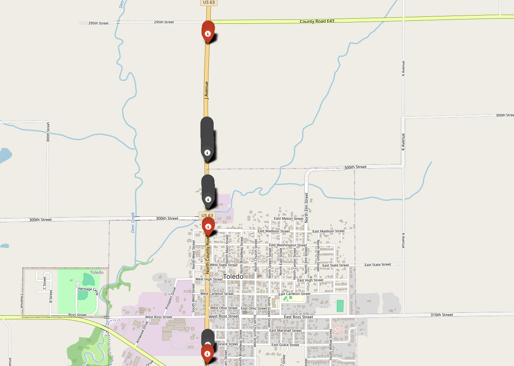
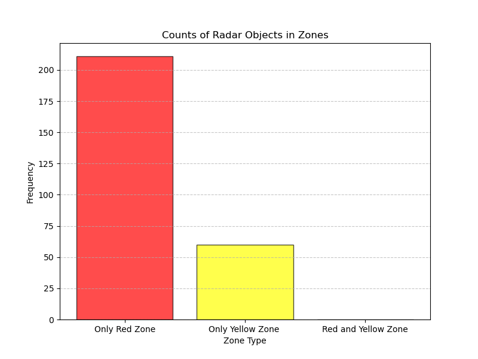
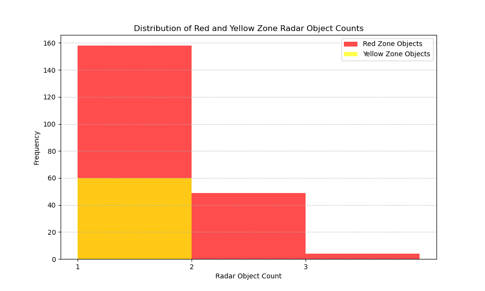
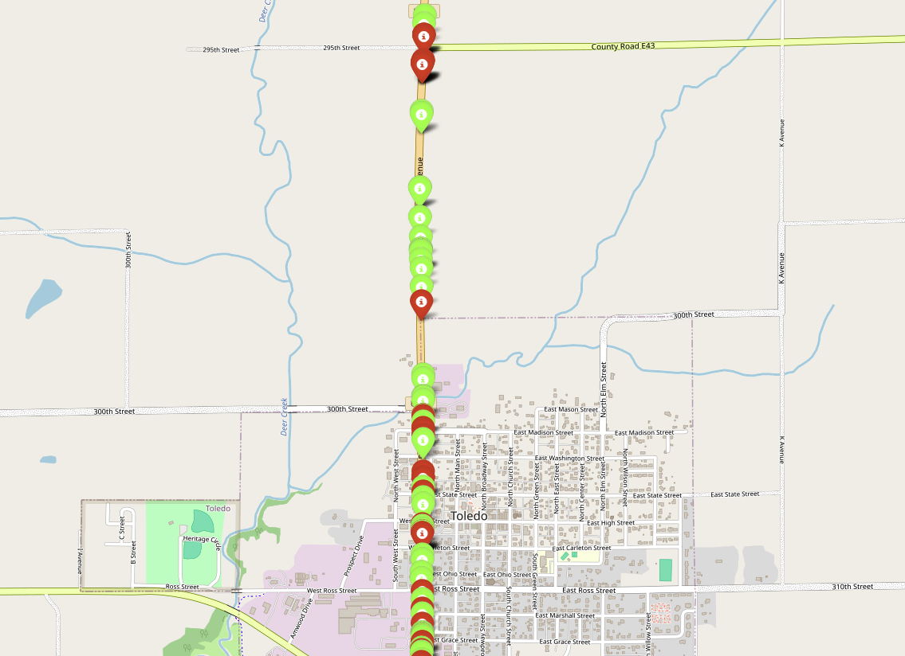

# Visualization Results

This repository contains the following plots and interactive maps:

## Plots

### Distribution of lane deviation (ft)

### [Deviation Map (Interactive- open in tab)](https://mahemon.github.io/SnowPlow_Live/ui_string/plots/deviation_map_updated.html)

### Radar Object Count in Red and Yello Zone!

### Distribution of Radar Object counts

### [Radar Object Map (Interactive - open in tab)](https://mahemon.github.io/SnowPlow_Live/ui_string/plots/radar_map_updated.html)

# Copyright
This repository is licensed under the [CC BY-NC-ND 4.0](https://creativecommons.org/licenses/by-nc-nd/4.0/) license.
